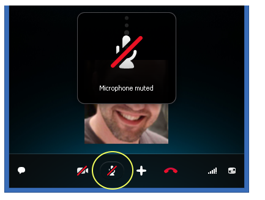

# howtounmute.com
How many engineers does it take to unmute a conference system? A lot. Here's a repo of how to unmute!

I've been [working remotely now, from home, for over half a decade](CategoryView.aspx?category=Remote+Work). I work in my [home office](NewJobNewHouseNewBabyAndDesigningATotallyNewHomeOffice.aspx), from cafes, from my tethered mobile, basically anywhere I can be productive and not [feel like a phony](exploringimpostorsyndromeintechnologysxsw15.aspx).

Here's the thing, though. I have to go to meetings, and I spend 15 minutes of those meetings waiting for YOU (yes, you, there) to unmute your mic, setup your cam, mess around with your internet, and generally waste the remote worker's (yes, me, here) time.

So, as a customer service to the internet, I present.

### [http://howtounmute.com](http://howtounmute.com)

That domain points directly to this post. Please, tell your friends family and clients.

Why not include [http://howtounmute.com](http://howtounmute.com) as a link in your meetings?

## Is your mic muted?

### Using Skype?

See that circled icon? That's a muted microphone. Click to unmute.

### Using Lync?

In Lync, this means your phone and mic are turned off.

Click the left one to unmute! Click the right one to turn on your cam! You can also use the "Win+F4" global hotkey to unmute Lync.

### Using Google Hangouts?

The unmute button is at the top of the hangout.

Click the little Settings Gear to select your microphone and speakers from within Google Hangouts.

### Using Some Weird old Adobe Flash-based Web Conferencing Thing?

Seriously, stop. What's wrong with you? Then, right click on the box where the app is running and click Settings...

You can select your Microphone and see the bar move on the right, indicating it can hear you.

## Wait, did you select the right microphone globally?

Most apps let you select microphones within the app. You can also set your preferred mic globally.

Which mic am I using? Right click on the little speaker near the clock and select "Recording Devices."

Some machines have more than one microphone. Windows lets you set a "Default Communications Device" for calls like Skype, and this is different from the "Default Device" for regular audio apps like Audacity. Right click to set your default.

> **PRO TIP:** Tap your microphone (or where you think it is) to confirm where you THINK it is. Watch the green bars move.

Applications can also select their individual preferred microphone. Here's Tools | Options in Skype. See how I can select where I want my audio output to go? And where I want my input to come from?

### Got a Mac?

That's cool. Type "Sound" into Spotlight and open your settings. Note you can see your input volume, your preferred input devices and preferred output device.

### Got a physical phone?

There is VERY likely a microphone mute button on the phone. Familiarize yourself with the phone's buttons and try this one.

Maybe you have a headset? Does it have a mute button? Maybe you bumped it.

## Call to AUDIBLE ACTION

If you take 5 to 10 minutes NOW to make sure you know how to select your microphone and umute yourself, you will save remote workers everywhere 15 minutes for every 1 hour meeting.
